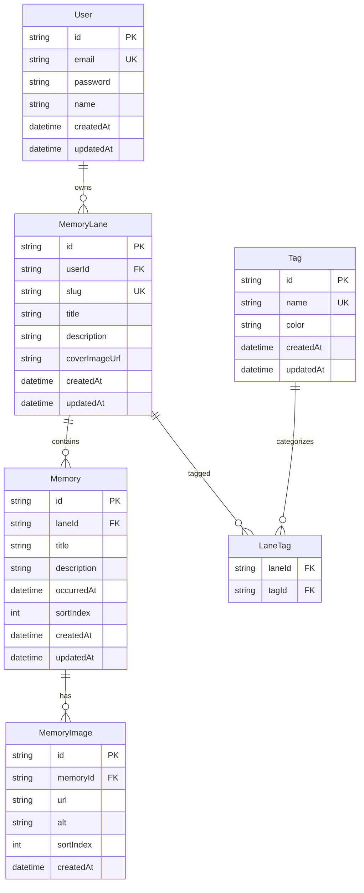
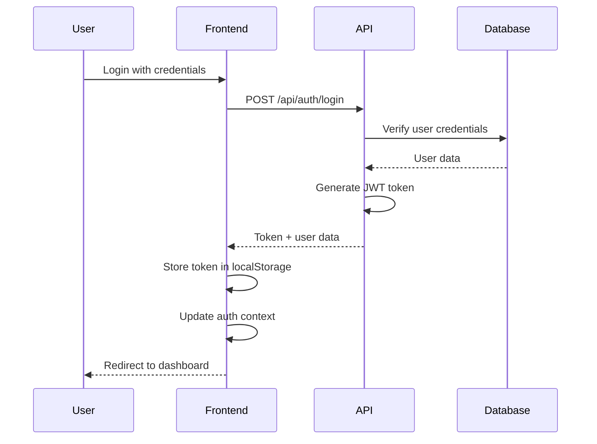

# 🚀 Memory Lane Implementation Overview

## Project Summary

Memory Lane is a Next.js 15 application that allows users to create and share chronological collections of memories with images, organized by dynamic tags. The application features a Netflix-style interface with user authentication and real-time data management.

## 🏗️ Architecture Overview

### Tech Stack
- **Frontend**: React 18, Next.js 15 (App Router), TypeScript
- **Styling**: Tailwind CSS, shadcn/ui components
- **State Management**: TanStack Query (React Query) for server state
- **Forms & Validation**: react-hook-form, zod
- **Backend**: Next.js API routes (BFF pattern)
- **Database**: Supabase PostgreSQL with Prisma ORM
- **Storage**: Supabase Storage for image uploads
- **Authentication**: JWT-based with bcrypt password hashing
- **Deployment**: Vercel (frontend + backend), Supabase (DB + Storage)

### Database Schema


## 🎯 Key Features Implemented

### 1. User Authentication System
- **JWT-based authentication** with secure password hashing
- **User registration and login** with form validation
- **Protected routes** and API endpoints
- **Session management** with automatic token refresh
- **User context** for application-wide authentication state

### 2. Memory Lane Management
- **CRUD operations** for memory lanes
- **User-scoped data access** (users can only access their own lanes)
- **Slug-based routing** for SEO-friendly URLs
- **Cover image support** with Supabase Storage integration
- **Tag-based categorization** system

### 3. Memory Management
- **Chronological timeline** display of memories
- **Multiple image support** per memory
- **Image reordering** and alt text management
- **Memory CRUD operations** with optimistic updates
- **Responsive image galleries** with lazy loading

### 4. Netflix-Style Home Page
- **Tag-based carousels** for organizing memory lanes
- **Horizontal scrolling** with smooth animations
- **Responsive card layout** for different screen sizes
- **Search and filtering** capabilities
- **Loading states** and empty state handling

### 5. My Lanes Page
- **User-specific lane listing** with proper filtering
- **Search and sort functionality** by title, date, etc.
- **Pagination support** for large datasets
- **Real-time cache invalidation** when users switch

## 🔧 Technical Implementation Details

### Authentication Flow


### Cache Invalidation Strategy
The application implements a sophisticated cache invalidation system to ensure users only see their own data:

1. **User-Specific Query Keys**: Each query includes the user ID to create separate cache entries
2. **Targeted Invalidation**: Only user-specific data is cleared, preserving non-user-specific data like tags
3. **Authentication State Management**: Cache is cleared on login, logout, and authentication errors
4. **React Hook Dependencies**: Proper useCallback usage to prevent unnecessary re-renders

### API Design
- **RESTful API structure** with consistent response formats
- **Error handling** with proper HTTP status codes
- **Input validation** using Zod schemas
- **Pagination support** for large datasets
- **Search and filtering** capabilities

### State Management
- **TanStack Query** for server state management
- **React Context** for authentication state
- **Local state** for UI interactions
- **Optimistic updates** for better user experience

## 📁 Project Structure

```
src/
├── app/                    # Next.js App Router pages
│   ├── api/               # API routes
│   │   ├── auth/          # Authentication endpoints
│   │   ├── lanes/         # Memory lane endpoints
│   │   ├── memories/      # Memory endpoints
│   │   └── tags/          # Tag endpoints
│   ├── lanes/             # Lane pages
│   └── explore/           # Public exploration page
├── components/            # React components
│   ├── auth/              # Authentication components
│   ├── home/              # Home page components
│   ├── lanes/             # Memory lane components
│   ├── layout/            # Layout components
│   └── ui/                # Reusable UI components
├── contexts/              # React contexts
├── hooks/                 # Custom React hooks
├── lib/                   # Utility libraries
├── services/              # API service layer
└── types/                 # TypeScript type definitions
```

## 🚀 Key Achievements

### 1. User Experience
- **Seamless authentication** with automatic session management
- **Real-time data updates** without page refreshes
- **Responsive design** that works on all devices
- **Intuitive navigation** with clear user flows

### 2. Performance
- **Optimized queries** with proper caching strategies
- **Lazy loading** for images and components
- **Efficient state management** with minimal re-renders
- **Fast page loads** with Next.js optimizations

### 3. Security
- **Secure password hashing** with bcrypt
- **JWT token authentication** with proper expiration
- **User-scoped data access** preventing unauthorized access
- **Input validation** and sanitization

### 4. Maintainability
- **TypeScript** for type safety
- **Consistent code structure** and naming conventions
- **Comprehensive error handling** and logging
- **Modular component architecture**

## 🔄 Data Flow

### Memory Lane Creation
1. User fills out lane creation form
2. Frontend validates input with Zod
3. API creates lane with user ID
4. Database stores lane with proper relationships
5. Cache is updated with new lane data
6. User is redirected to the new lane

### Memory Addition
1. User clicks "Add Memory" button
2. Memory form modal opens
3. User uploads images to Supabase Storage
4. Memory is created with image references
5. Timeline is updated with new memory
6. Cache is invalidated and refetched

### User Switching
1. User logs out (cache is cleared)
2. Different user logs in
3. Cache is cleared again for safety
4. New user's data is fetched fresh
5. UI updates to show correct user's data

## 🎨 UI/UX Features

### Netflix-Style Interface
- **Horizontal carousels** for different tag categories
- **Card-based design** with hover effects
- **Smooth animations** and transitions
- **Responsive grid layouts**

### Memory Timeline
- **Chronological organization** by date
- **Year-based grouping** for easy navigation
- **Image galleries** with navigation controls
- **Edit controls** for authenticated users

### Authentication UI
- **Modal-based login/register** forms
- **User menu** with profile information
- **Loading states** during authentication
- **Error handling** with user-friendly messages

## 🧪 Testing & Quality Assurance

### Code Quality
- **ESLint** for code linting
- **Prettier** for code formatting
- **TypeScript** for type checking
- **Husky** for pre-commit hooks

### Error Handling
- **Comprehensive error boundaries** for graceful failures
- **User-friendly error messages** for better UX
- **Retry mechanisms** for failed requests
- **Fallback UI** for loading and error states

## 🚀 Future Enhancements

### Planned Features
- **Real-time collaboration** on memory lanes
- **Social sharing** capabilities
- **Advanced search** with filters
- **Mobile app** development
- **Offline support** with service workers

### Technical Improvements
- **Performance monitoring** and analytics
- **A/B testing** framework
- **Automated testing** suite
- **CI/CD pipeline** optimization


## 🔐 Security Considerations

### Authentication Security
- **Password hashing** with bcrypt (12 rounds)
- **JWT tokens** with 2-hour expiration
- **Secure cookie** handling
- **CSRF protection** with proper headers

### Data Security
- **User-scoped access** controls
- **Input validation** and sanitization
- **SQL injection** prevention via Prisma
- **XSS protection** with proper escaping

## 📈 Scalability Considerations

### Database Optimization
- **Proper indexing** on frequently queried fields
- **Pagination** for large datasets
- **Query optimization** with Prisma
- **Connection pooling** for better performance

### Caching Strategy
- **Multi-level caching** (browser, CDN, database)
- **Cache invalidation** strategies
- **Query result caching** with TanStack Query
- **Image CDN** for faster loading

This implementation provides a solid foundation for a memory sharing application with room for future enhancements and scaling.
